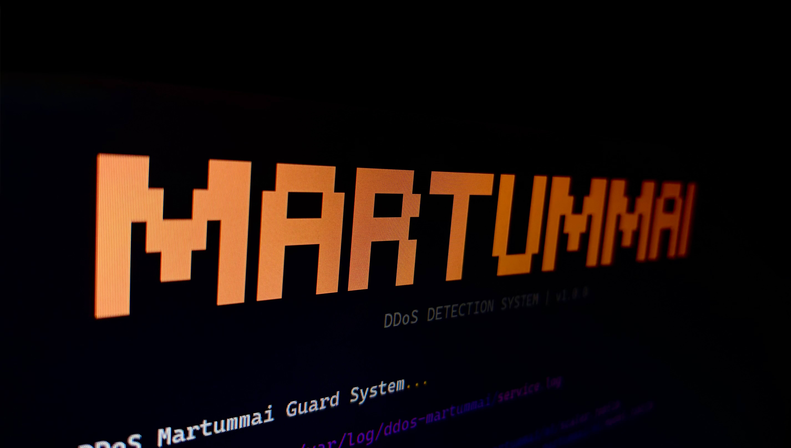

<div align="center">
	<br>
  <p></p>
  <h1>DDoS MarTumMai</h1>
  <a href="https://github.com/261492-martummai/ddos-martummai/releases/latest"></a>
	<br>
    <br>
  <p align="center"></p>
</div>

_DDoS MarTumMai_ is an intelligent DDoS detection and mitigation system powered by a fine-tuned machine learning model. It analyzes network traffic flows and automatically blocks malicious attacks before they impact your services.

## Installation & Usage

If you simply want to **use** the DDoS detection system on your server to protect your network, follow these instructions. You do not need to clone the source code.

### 1. Installation

The easiest way to install or update the system is using our automated installation script.

**Option A: Install the Latest Version (Recommended)**
This command automatically fetches and installs the latest stable release.

```bash
curl -fsSL https://raw.githubusercontent.com/261492-martummai/ddos-martummai/main/install.sh | sudo bash
```

**Option B: Install a Specific Version**
If you need to install a specific version (e.g., `v0.1.0`), append the version tag at the end of the command:

```bash
curl -fsSL https://raw.githubusercontent.com/261492-martummai/ddos-martummai/main/install.sh | sudo bash -s -- v0.1.0
```

<details>
<summary><b>Option C: Manual Installation (.deb)</b></summary>

1. Go to the [Releases Page](https://github.com/261492-martummai/ddos-martummai/releases/latest).
2. Download the `.deb` file (e.g., `ddos-martummai_1.0.0_amd64.deb`).
3. Run the following commands:
   ```bash
   sudo apt update
   sudo apt install ./ddos-martummai_*.deb
   ```
   </details>

### 2. Running the System

Once installed, you can run the system in two ways:

#### Run as a Background Service (Production)

This is the recommended way to keep your server protected continuously.

```bash
# 1. Run the setup wizard to configure Network Interface and Email Alerts
sudo ddos-martummai --setup

# 2. Start the background service
sudo systemctl start ddos-martummai

# 3. Enable the service to start automatically on system boot
sudo systemctl enable ddos-martummai
```

#### Run as Standalone CLI (Testing/Debugging)

Useful for testing or monitoring the output manually.

```bash
# Live Network Monitoring (Requires Root)
sudo ddos-martummai

# Test Mode (Simulate detection using a prepared PCAP/CSV file)
sudo ddos-martummai -t -f ./flow.csv

# View Help & Options
ddos-martummai --help
```

## For Developers: Contribution Guide

This section is for developers who want to contribute to the codebase, build new features, or train the ML model.

### Prerequisites

- **Python 3.13+**
- **Git**
- **uv**: An extremely fast Python package installer. ([Installation Guide](https://docs.astral.sh/uv/getting-started/installation/#standalone-installer))

### Development Setup

1. **Clone the repository:**

   ```bash
   git clone https://github.com/261492-martummai/ddos-martummai.git
   cd ddos-martummai
   ```

2. **Install dependencies:**
   This command creates a virtual environment and installs all required packages (including dev tools).

   ```bash
   uv sync --dev
   ```

3. **Run the application locally:**

   ```bash
   # Live mode
   uv run ddos-martummai

   # Test mode with a CSV file
   uv run ddos-martummai -t -f ./cicflows.csv
   ```

### VS Code Configuration (Recommended)

To ensure code consistency:

1. Install the **Ruff** extension (Publisher: Astral Software) in VS Code.
2. The included `.vscode` folder will automatically activate the recommended formatting settings upon saving.

### Branching and Contribution Strategy

We adhere to a strict Pull Request (PR) workflow. Direct pushes to protected branches are disabled.

- **`main`**: Production-ready branch. Contains only stable code.
- **`dev`**: Integration branch. Features are merged here first.

**Workflow Steps:**

1. **Create a Feature Branch** from `dev`:
   ```bash
   git checkout dev
   git pull
   git checkout -b feature/your-feature-name
   ```
2. **Develop and Test**: Ensure your code passes the quality checks locally:
   ```bash
   uv run checker
   uv run pytest
   ```
3. **Open a PR**: Push your branch and open a Pull Request targeting `dev`.
4. **CI/CD Checks**: GitHub Actions will automatically check Formatting (Ruff), Security (Bandit), and Unit Tests (Pytest).
5. **Merge**: Once CI passes and the code is reviewed, your PR will be merged.

### Project Structure

- `src/`: Core application source code.
- `tests/`: Unit and integration tests.
- `pyproject.toml`: Dependency and tooling configuration (Ruff, Bandit, etc.).
- `.github/workflows/`: CI/CD automation pipelines.

## Troubleshooting

- **Problem:** `git push` is rejected with a "protected branch" error.
  - **Cause:** You are trying to push directly to `main` or `dev`. We use Branch Protection rules, so direct pushes are not allowed.
  - **Solution:** If you have already committed your changes, you don't need to undo them. Just move your commits to a new branch and push that instead:

    ```bash
    # 1. Create a new branch containing your current commits
    git checkout -b feature/your-branch-name

    # 2. Push the new branch to GitHub
    git push -u origin feature/your-branch-name
    ```

- **Problem:** `git push` fails with an authentication error.
  - **Solution:** GitHub no longer supports password authentication. Use a Personal Access Token (PAT) with `repo` scope instead.

- **Problem:** CI fails with "Branch out of date".
  - **Solution:** Click "Update branch" in the PR page to merge the latest target branch changes into your feature branch, then wait for the checks to rerun.

## Dataset

This model was trained using the CICDDoS2019 dataset
provided by the Canadian Institute for Cybersecurity (CIC).

The dataset is not redistributed in this repository.
Please download it from the official source:

https://www.unb.ca/cic/datasets/ddos-2019.html

## Third-Party Components

This project utilizes the following open-source software:

- CICFlowMeter (MIT License)
  https://github.com/hieulw/cicflowmeter

See THIRD_PARTY_LICENSES.md for full license details.
